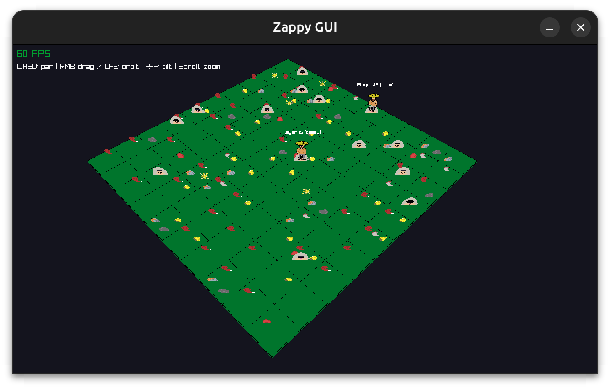
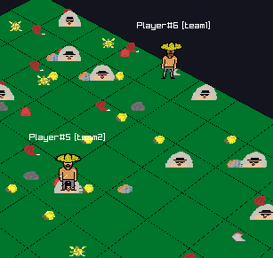
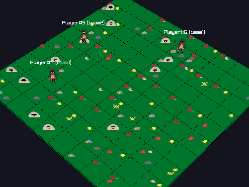

# Zappy

> *A tribute to Zaphod Beeblebrox*

Zappy is a networked multiplayer survival game set on the planet **Trantor** — a zero-relief world where teams of AI-driven players compete to be the first to elevate six of their members to the maximum level.

---



---

## Table of contents

- [Overview](#overview)
- [Binaries](#binaries)
- [Requirements](#requirements)
- [Build](#build)
- [Usage](#usage)
- [Gameplay](#gameplay)
- [Architecture](#architecture)
- [Team](#team)

---

## Overview

The game runs across three independent binaries communicating over TCP:

- **`zappy_server`** — manages the world, game rules, and all player interactions
- **`zappy_gui`** — graphical visualization of the world in real time
- **`zappy_ai`** — an autonomous AI client that drives one player

The winning team is the first to have **at least 6 players reach elevation level 8**.

---



---

## Binaries

| Binary | Language | Role |
|--------|----------|------|
| `zappy_server` | C++20 | TCP server, game logic, resource spawning, time management |
| `zappy_gui` | C++ / raylib | Real-time graphical client |
| `zappy_ai` | C++ | Autonomous AI player client |

---

## Requirements

- `g++` ≥ 12 with C++20 support
- `make`
- `raylib` ≥ 5.0 (for the GUI)
- `libcriterion-dev` (for tests only)

Install dependencies on Ubuntu/Debian:
```bash
sudo apt-get install -y build-essential make cmake git \
    libx11-dev libxrandr-dev libxinerama-dev libxcursor-dev libxi-dev \
    libgl1-mesa-dev
```

Install raylib from source:
```bash
git clone --depth 1 --branch 5.0 https://github.com/raysan5/raylib.git
cd raylib && mkdir build && cd build
cmake .. -DBUILD_SHARED_LIBS=OFF
sudo make install
```

---

## Build

Build all three binaries from the project root:
```bash
make
```

Or build individually:
```bash
make zappy_server
make zappy_gui
make zappy_ai
```

Run unit tests:
```bash
make tests
```

Clean:
```bash
make clean    # remove object files
make fclean   # remove object files and binaries
make re       # fclean + all
```

---

## Usage

### 1. Start the server

```bash
./zappy_server -p port -x width -y height -n name1 name2 ... -c clientsNb -f freq
```

| Option | Description | Required | Default |
|--------|-------------|----------|---------|
| `-p` | Port number (1–65535) | ✅ | — |
| `-x` | World width | ✅ | — |
| `-y` | World height | ✅ | — |
| `-n` | Team names (space-separated, one or more) | ✅ | — |
| `-c` | Number of client slots per team | ✅ | — |
| `-f` | Frequency — reciprocal of time unit | ❌ | `100` |

**Example:**
```bash
./zappy_server -p 4242 -x 20 -y 20 -n team1 team2 -c 6 -f 100
```

Press **Ctrl+D** in the server terminal for a clean shutdown.

---

### 2. Start the GUI

```bash
./zappy_gui -p port -h machine
```

| Option | Description |
|--------|-------------|
| `-p` | Port of the running server |
| `-h` | Hostname of the server (default: `localhost`) |

**Example:**
```bash
./zappy_gui -p 4242 -h localhost
```

---

### 3. Start AI clients

```bash
./zappy_ai -p port -n name -h machine
```

| Option | Description |
|--------|-------------|
| `-p` | Port of the running server |
| `-n` | Team name to join |
| `-h` | Hostname of the server (default: `localhost`) |

**Example:**
```bash
./zappy_ai -p 4242 -n team1 -h localhost
./zappy_ai -p 4242 -n team1 -h localhost  # run multiple AI clients per team
```

---

### Quick start — full game in 4 commands

```bash
# Terminal 1 — server
./zappy_server -p 4242 -x 20 -y 20 -n team1 team2 -c 6 -f 100

# Terminal 2 — GUI
./zappy_gui -p 4242 -h localhost

# Terminal 3 — team1 AI clients
for i in $(seq 1 6); do ./zappy_ai -p 4242 -n team1 -h localhost & done

# Terminal 4 — team2 AI clients
for i in $(seq 1 6); do ./zappy_ai -p 4242 -n team2 -h localhost & done
```

---



---

## Gameplay

### World

Trantor is a **toroidal map** — players exiting from one edge reappear on the opposite side. The world is populated with food and six types of stones:

| Resource | Density |
|----------|---------|
| Food | 0.5 |
| Linemate | 0.3 |
| Deraumere | 0.15 |
| Sibur | 0.1 |
| Mendiane | 0.1 |
| Phiras | 0.08 |
| Thystame | 0.05 |

Resources respawn automatically every 20 time units.

### Players

Each player starts with 10 food units (1260 time units of life). They can:
- Move forward, turn left/right
- Look at their surroundings
- Pick up and drop resources
- Broadcast messages to all players (with directional cues)
- Eject other players from their tile
- Fork (lay an egg to allow a new team member to connect)
- Start an elevation incantation

### Elevation

To level up, a group of players of the same level must gather on a tile with the required resources:

| Level | Players | Linemate | Deraumere | Sibur | Mendiane | Phiras | Thystame |
|-------|---------|----------|-----------|-------|----------|--------|----------|
| 1→2 | 1 | 1 | 0 | 0 | 0 | 0 | 0 |
| 2→3 | 2 | 1 | 1 | 1 | 0 | 0 | 0 |
| 3→4 | 2 | 2 | 0 | 1 | 0 | 2 | 0 |
| 4→5 | 4 | 1 | 1 | 2 | 0 | 1 | 0 |
| 5→6 | 4 | 1 | 2 | 1 | 3 | 0 | 0 |
| 6→7 | 6 | 1 | 2 | 3 | 0 | 1 | 0 |
| 7→8 | 6 | 2 | 2 | 2 | 2 | 2 | 1 |

The ritual takes **300/f seconds**. All participating players are frozen during the incantation and advance to the next level on success.

### Winning condition

The first team to have **6 or more players at level 8** wins.

### Time

All action durations scale with the server's `-f` frequency:

| Action | Cost |
|--------|------|
| Forward / Turn / Look / Broadcast / Eject | 7/f s |
| Inventory | 1/f s |
| Fork | 42/f s |
| Incantation | 300/f s |

A lower `-f` slows the game (useful for debugging); the default is `100`.

---

## Architecture

```
.
├── server/          # TCP server — game logic, resource management, time
├── gui/             # Graphical client (raylib)
├── ai/              # Autonomous AI player
├── docs/            # Documentation and meeting notes
└── tests/           # CI unit tests (Criterion)
```

### Communication

All communication is over TCP. The server speaks two protocols simultaneously:

- **AI protocol** — request/response (clients send commands, server responds when the action completes)
- **GUI protocol** — event push (server pushes world state changes to all connected GUIs in real time)

The GUI authenticates by sending `GRAPHIC` as its team name. AI clients authenticate by sending their team name.

---

## Team

| Person | Role |
|--------|------|
| **Esteban** | Server core — `poll()` loop, socket management, client buffers, arg parsing, CI |
| **Sejun** | Game logic — map, players, teams, eggs, elevation, resources, time |
| **William** | GUI protocol — 25-message protocol, event formatting, GUI handshake |
| **Mateo** | GUI render — raylib visualization, 2D/3D world display |
| **Pierre** | AI client — survival strategy, team coordination, elevation strategy |

---

*Epitech — 2025 — Promotion 2029*